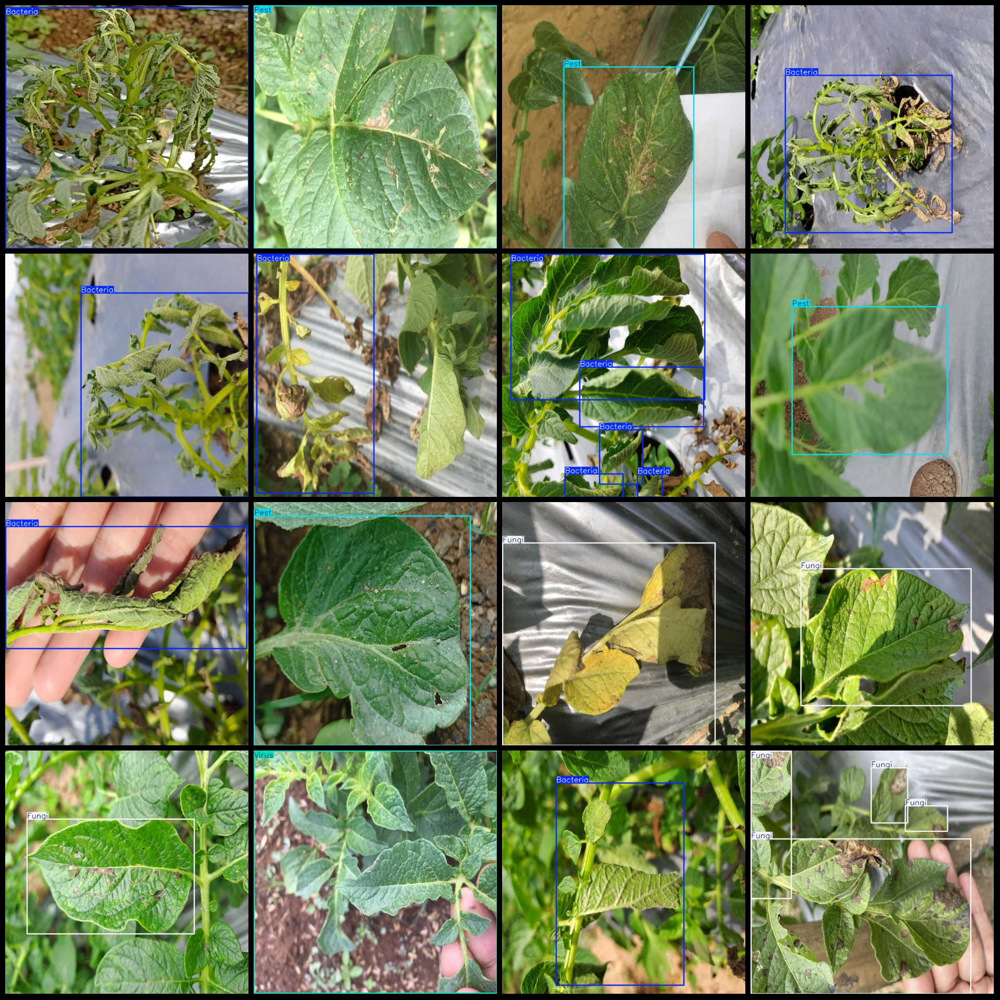
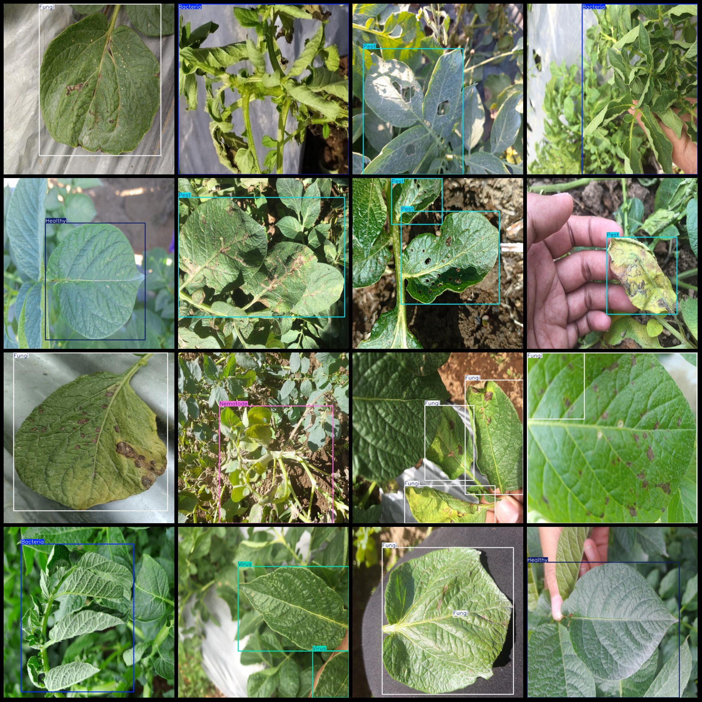

# Intelligent Agriculture Potato Leaf and Tuber Rot Disease Detection Dataset VOC+YOLO Format with 3,004 Images in 7 Categories

Dataset format: Pascal VOC format + YOLO format (txt file without split path, only contains jpg images and corresponding VOC format xml file and YOLO format txt file)
number of images: 3004  
Labeled quantity (xml file count): 3004
annotation count: 3004  
annotationnumber of classes: 7  
Annotation class names: ["Bacteria", "Fungi", "Healthy", "Nematode", "Pest", "Phytopthora", "Virus"]
boxes per class:   
Bacteria box count = 1284  
Fungi box count = 1167  
Healthy box count = 300  
Nematode box count = 129  
Pest box count = 894
Phytopthora box count = 370  
Virus box count = 1407
total boxes: 5551  
images per class:   
Bacteria images = 566  
Fungi images = 739
"Healthy" is a noun.
Nematode images = 69
Pest images = 599
Phytopthora (Phytophthora) occupies a total of 306 images.
Virus images are 524.
Image resolution: 640x640
Use the annotation tool: labelImg
Annotation rules: draw a rectangle around the class
Important notes: dataset needs to be divided into training, validation, and test sets; this is required by the tool.
Special Disclaimer: This dataset does not guarantee the accuracy of the trained model or the weight files.
Image preview:
Example:
## Images

Here is a pay link on Stripe ( https://buy.stripe.com/3cs8yP7sY87d0vu9AB ). Please contact me lonlonago@foxmail.com after funding $89, and I will send you a complete data files , thank you!

